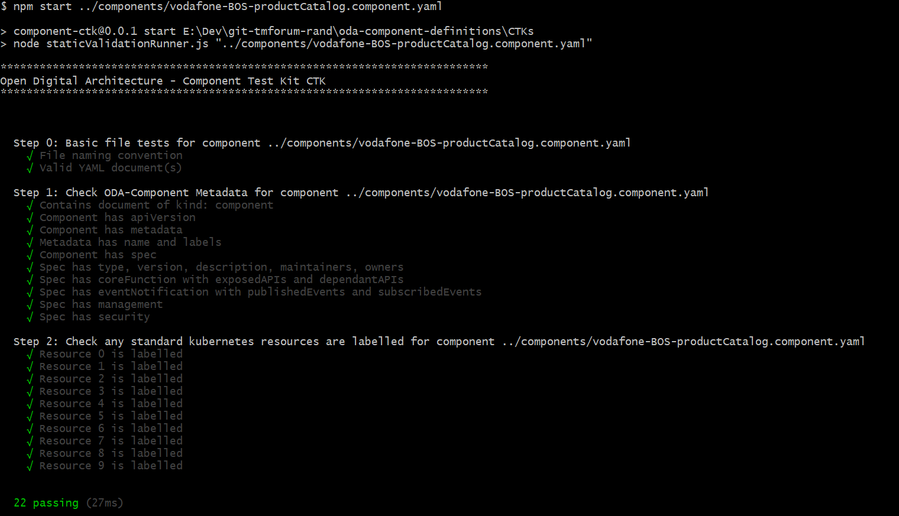

# ODA Component Compliance Test Kit (CTK)

This folder contains the test runner that executes the CTK tests for each component.

The CTKs allow components to be promoted from the Stage 1 (Sandbox) to Stage 2 (Validation that components conform to the Component Design Guidelines). In a future sprint we will define additional CTKs to promote to stage 3  (conforming to design guidelines and implemeting a standard functional footprint).

For the Stage 2 validation, we split this into:
* A static validation of design-time compliance to the Component Envelope design guidelines (found at [ODA-Component design guidelines](../oda-ca-docs/ODAComponentDesignGuidelines.md)).
* Run-time validation that the component run-time behavour matches the envelope description.


Install the dependencies with the command:

``` 
npm install
```

Execute the validation tests with the command:
```
npm start
```

The test runner executes the following steps:

* If started with a command-line arguement then use that as component envelope filename; Otherwise check for 'components' directory (`at ../components/`).

Sample output:


