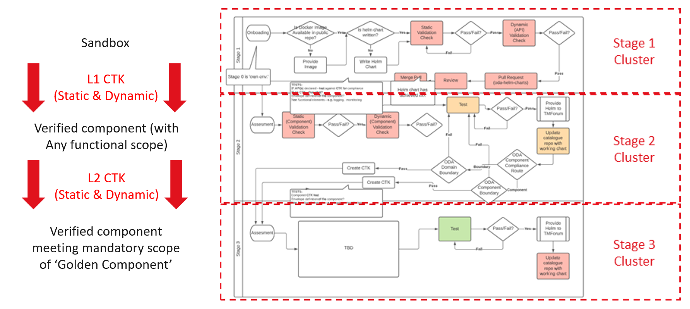
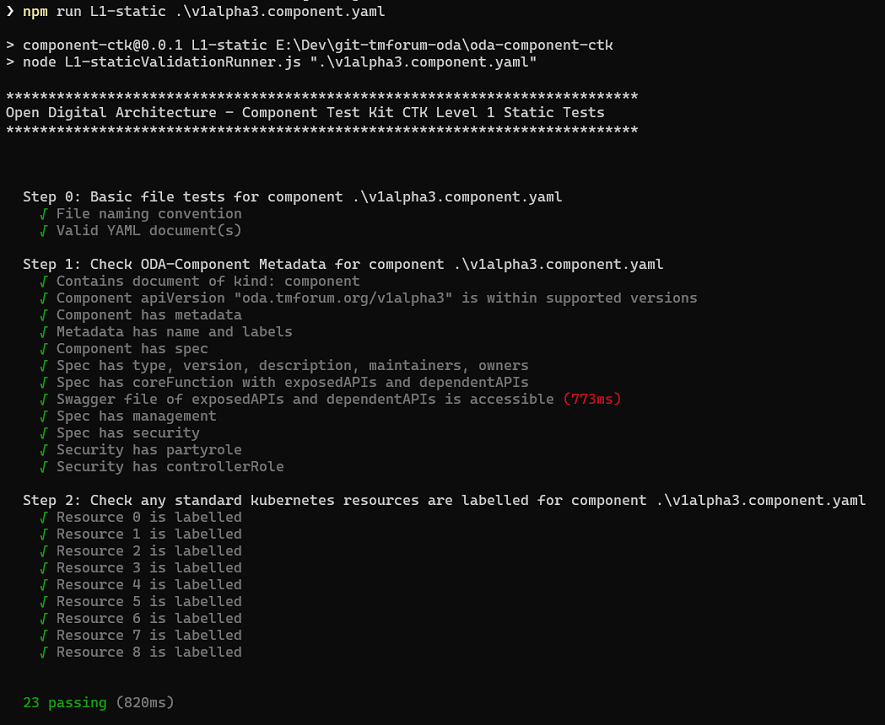
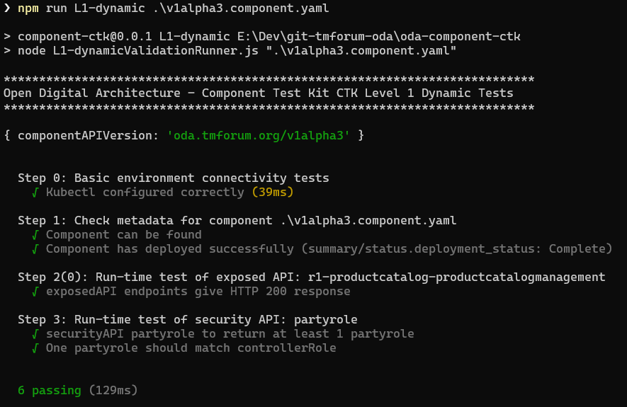
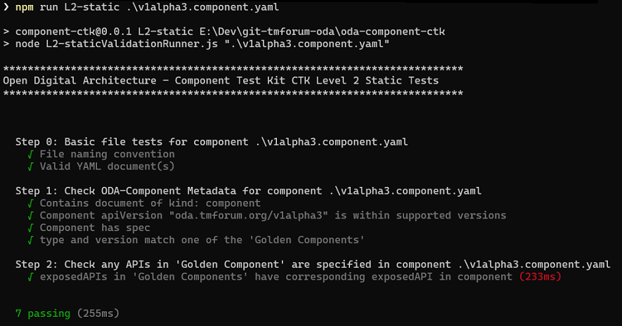
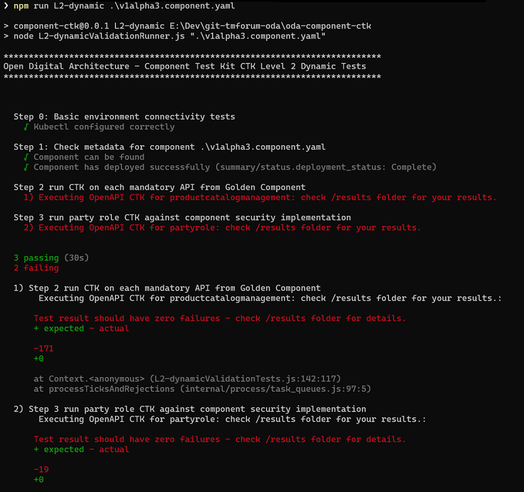

# ODA Component - CTK

This folder contains the  Compliance Test Kit (CTK) for an ODA Component. There is a video demonstration of the CTKs at https://www.youtube.com/watch?v=6f82SHgwz28

 [](https://www.youtube.com/watch?v=6f82SHgwz28)

There are two levels of CTK: 
* The L1 CTK allows components to be promoted from the Stage 1 (Sandbox) to Stage 2 (Components conform to the [Component design guidelines](https://github.com/tmforum-oda/oda-ca-docs/blob/master/ODAComponentDesignGuidelines.md), but could be of any functional scope). 
* The L2 CTK allows components to be promoted from Stage 2 to Stage 3 (Components that meet mandatory functional scope of the corresponding 'Golden Component').

The L1 and L2 CTKs each have a static part (that tests the Component Envelope metadata) and a dynamic part (that exercises the running component via API requests).




## Executing the CTK tests


Install the dependencies with the command:

``` 
npm install
```

Execute the validation tests with either:

```
npm run <CTK Test Type> -- <filename.component.yaml>
```

Where `<CTK Test Type>` is one of `L1-static`, `L1-dynamic`, `L2-static`, `L2-dynamic`.

It defaults to the `components` namespace. If you want to use an alternative, the command is:

```
npm run <CTK Test Type> -- <filename.component.yaml> --namespace <namespace name>
```

Typically you create the <filename.component.yaml> from your helm chart with the command

```
helm template <releasename> <chartfolder> > <filename.component.yaml>
```


**Note:** For the dynamic tests, the script reuses the `kubectl` configuration to connect to the associated kubernetes cluster. You have to deploy the component to this cluster before running the test.


Sample output (for the [Example Component](https://github.com/tmforum-oda/oda-ca-docs/tree/master/examples/Security-Role)):

**L1 Static**



**L1 Dynamic**



**L2 Static**



**L2 Dynamic** 




The L2 Dynamic CTK runs successfully, but the output is showing a failure. The detailed failure results are stored in the /results folder.


## Developing and extending the CTK tests

The CTK tests are written in NodeJS using the [Mocha](https://mochajs.org/) test framework and the [Chai](https://www.chaijs.com/) test assertion library. 

Each test has a *Runner* file that sets up the test and a *Tests* file containing the actual tests and assertions. e.g. the code for the L1-Static test is in `L1-staticValidationRunner.js` that calls the tests in `L1-staticValidationTests.js`.

A sample of code is shown below 

```
describe('Step 1: Check ODA-Component Metadata for component ' + componentEnvelopeName, function () {

    // get component YAML document
    documentArray = YAML.parseAllDocuments(file)
    const componentDoc = getComponentDocument(documentArray)

    it('Contains document of kind: component', function (done) {
      expect(componentDoc, "The document should have a field of 'kind: component'.").to.not.be.null
      done()
    })

    it('Component apiVersion "' + componentDoc.get('apiVersion') + '" is within supported versions', function (done) {
      const supportedVersions = ['oda.tmforum.org/v1alpha1', 'oda.tmforum.org/v1alpha2', 'oda.tmforum.org/v1alpha3']
      expect(componentDoc.get('apiVersion'), "Component should have an 'apiVersion' field of type string").to.be.a('string')
      expect(componentDoc.get('apiVersion')).to.be.oneOf(supportedVersions, "'apiVersion' should be within supported versions " + supportedVersions);
      done()
    })

    it('Spec has type, version, description, maintainers, owners ', function (done) {
      const spec = componentDoc.get('spec')
      expect(spec.get('type'), "Spec should have a 'type' field of type string").to.be.a('string')
      expect(spec.get('version'), "Spec should have a 'version' field of type string").to.be.a('string')
      expect(spec.get('description'), "Spec should have a 'description' field of type string").to.be.a('string')
      expect(spec.get('maintainers'), "Spec should have a 'maintainers' field of type object").to.be.a('object')
      expect(spec.get('owners'), "Spec should have a 'owners' field of type object").to.be.a('object')
      done()
    })
}
```


For each section of testing there is a `describe` method where you set-up the data required for the test, and then an `it` method for each test. A test will contain one or more assertions using the *Chai* library `expect` method.


For the L2 testing, you need to pre-populate the standard components and OpenAPI CTKs:
* The TM Forum standard components .YAML files go in the `/golden-components` folder. The first component `TMFC001: Product Catalog Management` is mastered at  [https://projects.tmforum.org/wiki/display/ODA/TMFC001%3A+Product+Catalog+Management](https://projects.tmforum.org/wiki/display/ODA/TMFC001%3A+Product+Catalog+Management).
* The TM Forum OpenAPI CTKs from [Open API Table](https://projects.tmforum.org/wiki/display/API/Open+API+Table) should be copied into the `/api-ctk` folder.


