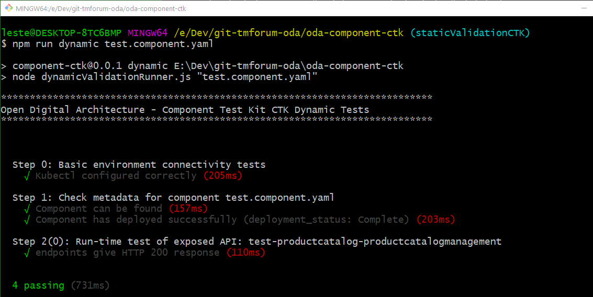

# ODA Component Compliance Test Kit (CTK)

This folder contains the test runner that executes  CTK tests for each component.

The CTKs allow components to be promoted from the Stage 1 (Sandbox) to Stage 2 (Validation that components conform to the Component Design Guidelines). In a future sprint we will define additional CTKs to promote to stage 3  (conforming to design guidelines and implemeting a standard functional footprint).

For the Stage 2 validation, we split this into:
* A static validation of design-time compliance to the Component Envelope design guidelines (found at [ODA-Component design guidelines](../oda-ca-docs/ODAComponentDesignGuidelines.md)).
* Run-time validation that the component run-time behavour matches the envelope description.


Install the dependencies with the command:

``` 
npm install
```

Execute the validation tests with either:

```
npm static <filename.component.yaml>
```

or

```
npm dynamic <filename.component.yaml>
```

Note: For the dynamic tests, the script reuses the `kubectl` configuration to connect to the associated kubernetes cluster. You have to deploy the component to this cluster before running the test.


Sample output for static validation:


Sample output for dynamic validation:




I would recommend running the static validation as part of every git commit into the component charts repository, and running the dynamic validation as part of the pull request process to propote a component to the stage 2.
